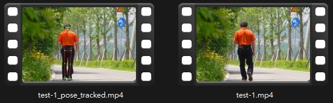

# 人工智慧期中作業：Google Colab 影片目標追蹤

## 組員
- 11125013 郭慧庭
- 11125032 林欣儀
- 11125036 夏振凱

---

## 一、前言與程式目的

本次作業的目標是使用 **Google Colab** 執行「影片目標追蹤」。  
我們原先依照題目教學示範流程操作，但因環境差異，原始方法在 **模型推論階段無法正常執行**。  
因此本組後續改以其他能在 Colab 正常執行的追蹤方法進行測試與比較。

- **題目教學來源：**  
  https://blog.csdn.net/qq_30347421/article/details/104534297

- **測試影片來源（免版權可下載使用）：**  
  https://pixabay.com/videos/search/people%20walking/?utm_source=chatgpt.com

---

## 二、題目原始方法

**資料與模型分別下載如下：**
| 資料項目              | 來源連結                                                                                                                                                 |
| ----------------- | ---------------------------------------------------------------------------------------------------------------------------------------------------- |
| video_analyst 程式庫 | [https://github.com/megvii-research/video_analyst](https://github.com/megvii-research/video_analyst)                                                 |
| 預訓練模型 Models      | [https://drive.google.com/drive/folders/1XhWIU1KIt9wvFpzZqEDaX-GrgZ9AVcOC](https://drive.google.com/drive/folders/1XhWIU1KIt9wvFpzZqEDaX-GrgZ9AVcOC) |
| OTB2015 測試資料集     | [https://drive.google.com/drive/folders/1n-wG-XhhnFnhKBG4PraVJB8Fz_-oKy2z](https://drive.google.com/drive/folders/1n-wG-XhhnFnhKBG4PraVJB8Fz_-oKy2z) |

### （1）資料放置結構
```nginx
MyDrive
├── video_analyst
│   └── datasets
│       └── OTB2015   ← 需手動放入
└── Models
    └── siamfcpp-googlenet-...pkl
```

### （2）掛載 Google Drive 與切換至程式根目錄
```python
from google.colab import drive
drive.mount('/content/drive/')
```

```python
import os
os.chdir('/content/drive/MyDrive/video_analyst/')
```
確認路徑：
```python
!ls
```

### （3）安裝需求套件
原始**requirements.txt**套件版本不相容，因此需調整後重新安裝：
```bash
!pip install -r requirements.txt
```
>註：此處需手動修正套件版本，否則無法成功編譯。

### （4）編譯相關模組
```bash
%cd videoanalyst/evaluation/vot_benchmark/pysot/utils/
!python3 setup.py build_ext --inplace
```
回到主目錄：
```bash
%cd /content/drive/MyDrive/video_analyst
```

### （5）修改設定檔（模型路徑）
開啟：
```swift
experiments/siamfcpp/test/otb/siamfcpp_googlenet-otb.yaml
```
將模型路徑改為：
```bash
/content/drive/MyDrive/Models/siamfcpp-googlenet-vot-md5_XXXX.pkl
```

### （6）修正程式碼相容性問題
| 位置                                  | 修正內容                                                                                 |
| ----------------------------------- | ------------------------------------------------------------------------------------ |
| `crop.py` / `tensorboard_logger.py` | `from collections import Iterable` → 改為 `from collections.abc import Iterable`       |
| `test.py` 添加                        | `root_cfg.test.track.pipeline.SiamFCppMultiTempTracker.st_mem_coef = 0.6` （補齊缺漏 key） |


### （7）執行測試程式
```python
import numpy as np
np.int = int

%cd /content/drive/MyDrive/video_analyst
import sys
sys.path.append("/content/drive/MyDrive/video_analyst")

%run main/test.py --config experiments/siamfcpp/test/otb/siamfcpp_googlenet-otb.yaml
```

### （8）最終執行結果
- 程式成功開始讀取模型並逐一進行追蹤測試
- 但在執行至第 67 隻測試序列（Lemming）時中斷
- 無法完成整體追蹤流程，因此無法產生完整結果影片

---

## 三、可在 Colab 成功執行的方法

下列三種方法皆可在 Google Colab 正常執行。  
執行前建議先準備測試影片，並掛載 Google Drive 或直接上傳影片。

### 共同前置作業

**掛載 Google Drive：**
```python
from google.colab import drive
drive.mount('/content/drive')
```
**或直接上傳影片：**
```python
from google.colab import files
files.upload()
```

---

### 方法 1：自動找人 + CSRT 追蹤
**Notebook：**
https://colab.research.google.com/drive/1myJMZpZqiKZTzWcI_MTvekDEtF_hy_na

**概念說明：**
- 第一幀用 HOG 自動偵測人物
- 擷取偵測框作為初始追蹤框
- 全程使用 CSRT 追蹤
- 輸出追蹤結果影片

**安裝環境**
```bash
!pip install -q opencv-contrib-python-headless==4.10.0.84 numpy==1.21.2
```

**輸出檔案**
`videos/auto_csrt_tracked.mp4`


**執行成果**
- **輸出影片：** 
  `videos/auto_csrt_tracked.mp4`
- **成果截圖：**  
  

**常見錯誤與處理方式**
| 錯誤訊息 | 原因 | 解決方式 |
|---|---|---|
| `AttributeError: module 'cv2.legacy' has no attribute 'TrackerCSRT_create'` | 安裝版本不含 CSRT 追蹤模組 | 重新安裝：`opencv-contrib-python-headless==4.10.0.84` |

---

### 方法 2：骨架偵測追蹤（MediaPipe Pose）
**Notebook：**
https://colab.research.google.com/drive/1H91ZppZwKA_QGpaH-PmXRAr2GZKtwkSJ

**概念說明**
- 使用 MediaPipe Pose 偵測 33 個人體關鍵點
- 以線段連接呈現骨架動作
- 適合：舞蹈、運動、姿勢分析

**安裝環境**
```bash
!pip install -q mediapipe==0.10.14 opencv-python-headless==4.10.0.84
```

**輸出檔案**
`videos/test-1_pose_tracked.mp4`


**執行成果**
- **輸出影片：** 
  `videos/test-1_pose_tracked.mp4`
- **骨架標示：**  
  

**常見狀況與處理方式**
| 問題     | 原因      | 解決方式                                    |
| ------ | ------- | --------------------------------------- |
| 骨架點抖動  | 偵測信心值不足 | 將 `min_detection_confidence` 調至 0.6–0.7 |
| 影片播放不順 | FPS 未固定 | 以 `VideoWriter` 固定 FPS                  |

---

### 方法 3：YOLO 偵測 + 多人 CSRT 追蹤
**Notebook：**
https://colab.research.google.com/drive/1Q5uEcF9hB27QALWkMBR2JAYDF9GiEdd3


**概念說明**
- YOLO 負責辨識畫面中所有「人」
- 每個人建立獨立 CSRT 追蹤器
- 可處理多人同時移動的影片

**安裝環境**
```bash
!pip install -q ultralytics==8.2.103 opencv-contrib-python-headless==4.10.0.84
```

**輸出檔案**
`videos/test-2_tracked.mp4`

**執行成果**
- **輸出影片：**
`videos/test-2_tracked.mp4`
- **追蹤截圖：**  
  

**常見狀況與處理方式**
| 問題       | 原因            | 解決方式                                  |
| -------- | ------------- | ------------------------------------- |
| 追蹤速度慢、會卡 | YOLO 模型太大     | 使用 `yolov8n.pt` 或提升 `DETECT_INTERVAL` |
| 框跳動或抓不到人 | 信心值太低 / 畫面不清楚 | 提高 confidence threshold               |

---

## 四、三種方法比較

| 方法 | 偵測方式 | 優點 | 缺點 | 適合情境 |
|---|---|---|---|---|
| 方法 1 | HOG + CSRT | 單人追蹤穩定、設定簡單 | 不支援多人 | **單人追蹤影片** |
| 方法 2 | MediaPipe Pose | 能呈現人體動作與姿勢 | 骨架可能抖動、對光影敏感 | **舞蹈 / 運動分析** |
| 方法 3 | YOLO + 多 CSRT | 可多人同時追蹤 | 計算量較大、速度較慢 | **多人群體畫面** |

---

## 五、執行截圖（本組實際紀錄）

| 描述 | 檔案 |
|---|---|
| 掛載 Google Drive 成功 | `assets/step2_mount.jpg` |
| 追蹤成果畫面 | `assets/step5_result.jpg` |

> 註：`step5_result.jpg` 對應方法 1 成果影片中的追蹤框畫面。

---

## 六、結論與使用建議

- **方法 1（HOG + CSRT）**  
  執行最穩定、步驟最少，適合初次實作與單人追蹤。

- **方法 2（MediaPipe Pose）**  
  可顯示人體關節與姿勢，適用需觀察動作的情境。

- **方法 3（YOLO + 多 CSRT）**  
  可多人追蹤，但運算較慢，適合複雜、多角色畫面。

**使用建議：**
| 需求 | 建議方法 |
|---|---|
| 想要成功率高、快完成 | 方法 1 |
| 想看人體動作 / 教學展示 | 方法 2 |
| 場景中有多人 | 方法 3 |

---
